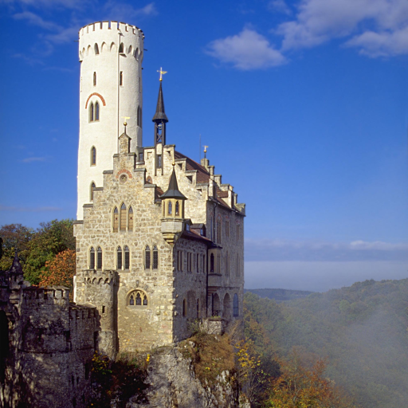
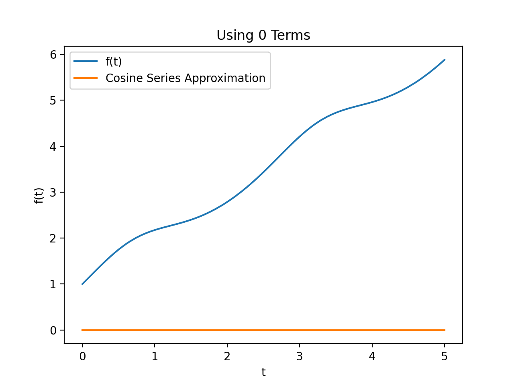
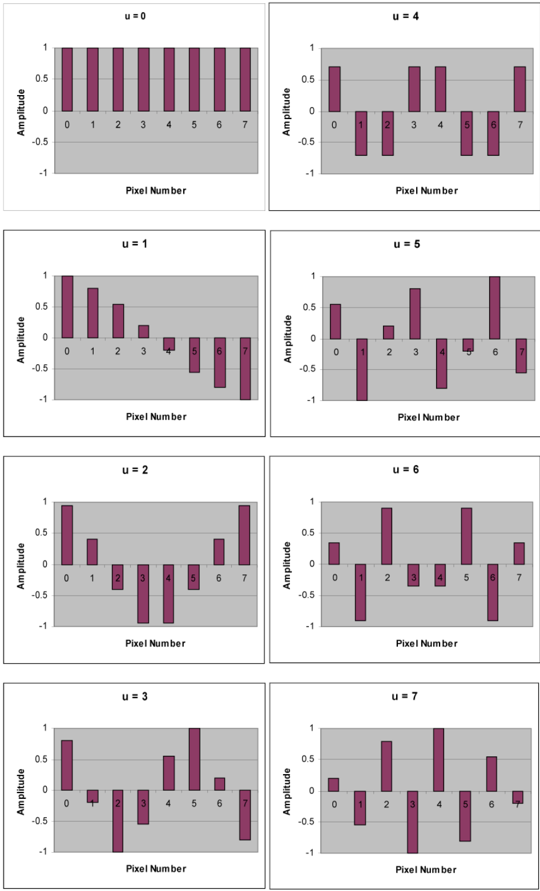
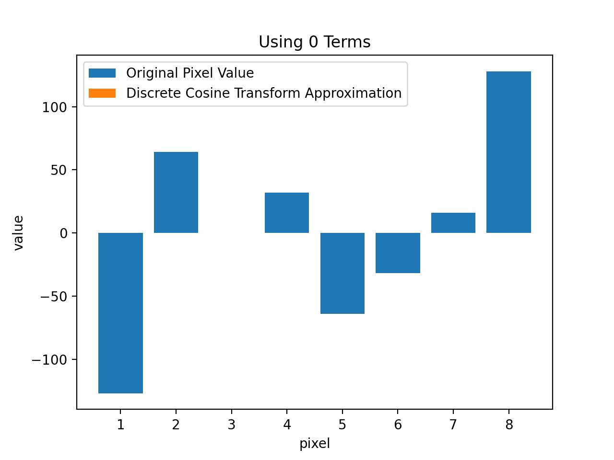
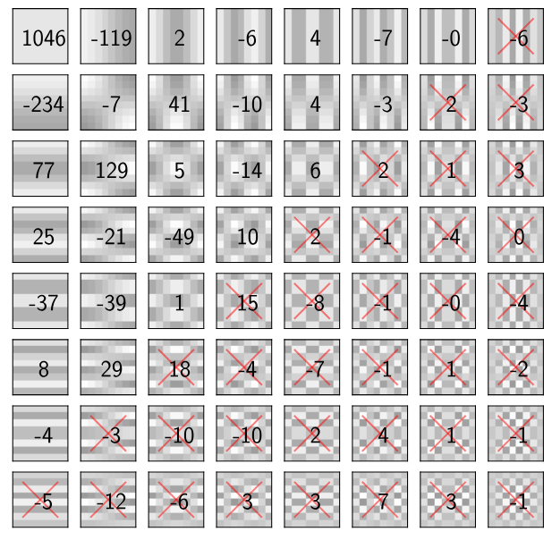
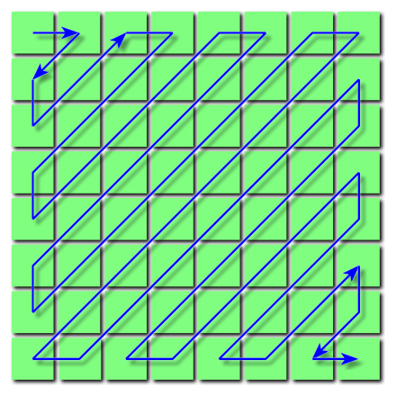

There are so many sources out there about how lossy compression algorithms are able to compress image files in the order of 40+ MB's to just Kilobytes, but none of them was really enough for my tiny brain to comprehend completely.

Specifically, I had a lot of trouble with the math behind it: the Discrete Fourier Transform. It's easy to say that DCT help "discard high-frequency data from the image", but what does that even mean?

DCT comes up in so many areas of science, but specifically in many common compression algorithms such as JPEG. This document is my journey into understanding the math and algorithm behind JPEG, and its effectiveness and brilliance!
## Why Does JPEG Work?

Our eyes are not perfect! Take a look at this [picture](https://commons.wikimedia.org/wiki/File:Lichtenstein_img_processing_test.png):



Natural images, like the one above, are perfect subjects for evaluating JPEGs compression, the good and the bad. This is tied to the compression algorithm itself, but also to our eyes and how we see the world.

- The JPEGs algorithm doesn't do well when there are **stark** color differences. Most natural pictures don't have these sharp changes in color, and JPEG artifacts are less visible. However, if you've ever used JPEG compression for an image of a logo, for example, you might have seen that the edges become blurry. 
- JPEG takes advantage of weaknesses in our eyes and brain; take the image above, for example.  
		- The region in the top right is a very smooth gradient of blue, and our eyes don't really care if we use the same shade of blue for very similar pixels. 
	 - For regions like the bottom left, even though there are a lot of stark color differences, our eyes glance over them! Our brains won't notice compression artifacts unless we are looking for them.
	 - Our eyes have 100 million rod cells, but only 6 million cone cells. This means our eyes are much more sensitive to brightness and luminance, rather than color or chrominance. JPEG discards some color information, but keeps all the luminance information, and our eyes never notice.

## How Does JPEG Work?

JPEG works in multiple steps. Some steps discard information from the image (**lossy**), while other simply compress data without discarding information (**lossless**). These are covered in the next sections.

### Color Space Conversion

A pixel in an 8-bit image has 3 components, each a byte value of 0-255. In this step, These RGB values are converted to YCbCr, where:
- Y: luminance
- Cb: blue chrominance
- Cr: red chrominance

This is done so chrominance (color) information can be discarded in the next step.

This process is <mark>lossless</mark>.

### Chrominance Downsampling

Our eyes are less sensitive to color, so we can get away with discarding some color info.

For example, 2x2 squares from the Cr and Cb values are extracted, and a singular average is set for all of them. This reduces space needed for Cr and Cb to 1/4 their original values.

So in total, the image size is reduced to **half** of its original value! The Cr and Cb values are copied up to match the size of Y values when decompression takes place.

This process is <mark>lossy</mark>.

### Discrete Cosine Transform (DCT) & Quantization

Our eyes are more sensitive to low frequency elements, and less sensitive to high frequency elements.
- Low frequency elements: The outlines of objects
- High frequency elements: Subtle variations in the details of an object

In very short terms, this process *smooths* out the image. This step is applied to Y, Cr and Cb steps independently.

DCT is <mark>lossless</mark>, but quantization is <mark>lossy</mark>.

But let's get into the details. How do DCT and Quantization work to discard pixel information without noticeable quality change?

#### WTF is DCT

Let's first talk about the Fourier transform. The Fourier Transform (FT) is a transform that converts a function into a form that describes the frequencies present in the original function. FT is analogous to decomposing the sound of a musical chord into terms of the intensity of its constituent pitches. 

It is used in many forms, but exactly how it comes in compression will be discussed later.

$$
{\displaystyle f(x)=\int _{-\infty }^{\infty }{\hat {f}}(\xi )\ e^{i2\pi \xi x}\,d\xi ,\quad \forall \ x\in \mathbb {R}}
$$

This is the general form, but computers can't calculate this! Computers work with discrete samples of data, and they don't understand math like we do. Also note that the $e^{\text{stuff}}$ value is another representation of sine and cosine.

This is where Discrete Time Fourier Transform (DTFT) comes into play. It is an alternative representation of FT:

$$
X_{2\pi }(\omega )=\sum _{n=-\infty }^{\infty }x[n]\,e^{-i\omega n}
$$

This is better, because the steps are discrete instead of continuous. Still, there are infinite values! So next up, Discrete Fourier Transform (DFT) comes up:

$$
{\displaystyle X_{k}=\sum _{n=0}^{N-1}x_{n}\cdot e^{-{\frac {i2\pi }{N}}kn}}
$$

DFT (Equivalent to FFT), has discrete steps, but it is also in a finite range! This makes it usable by computers.

Assume we have a sound wave, and we want to analyze what frequencies are within it. Sound waves are continuous, but when recording, we can only record a finite number of samples! In truth, using DFT loses some frequency information compared to if FT. However, if the sample numbers in a fixed time increase, the difference would be negligible for most functions.

##### An Important Distinction

Fourier Transform should not be confused with Fourier Series, although they are very similar.

Here is **my interpretation** of each:

- **Fourier Series, Cosine Series and Sine Series**  
	Is very similar to DTFT. It basically aims to approximate a *piecewise continuous* function with trigonometric functions. The difference is that DTFT is a sum of trigonometric functions from $- \infty$ to $\infty$, while at least with series, they have a fixed starting point but go to $\infty$ as well. For a function limited to a specific range, they are pretty much identical.
	
	The Fourier Series uses both sines and cosines, while the Cosine Series uses strictly cosines and the Sine Series uses strictly sines. When to use them depends on the usecase, since each has unique properties.

- **Discrete Fourier Transform (DFT/FFT), Discrete Cosine Transform (DCT) and Discrete Sine Transform (DST)**  
	Basically like the Fourier Series, but only applicable when instead of a continuous function, we have a discrete function. This is the **only form of Fourier functions that computers can understand!** If we use a discrete function but with step size that is very small, it is basically equivalent to the series discussed previously.

	DFT uses both sines and cosines, DCT strictly cosine and DST strictly sine. An interesting phenomenon, is that DCT and DST use half as many terms to describe the same values as DFT does, but they each have their own properties and usecases.


##### Example, Cosine Series Approximation
Here is an example to better visualize the two. Below is an animation of the first 20 terms of a sine series used to approximate a function in a specific range:

	

##### Example, Discrete Cosine Transform
Imagine we have a discrete function of 8 equally spaced values in the range $[1,8]$ and values between $[0, 255]$. We will call this function a **pixel array of size 8**. The value range doesn't matter, but it has to have a minimum and maximum.

Next, we define the **waveforms for an array of size 8**. These are built by plotting the functions $\cos(\omega t)$ where $\omega \in [0,7], \omega \in \mathbb{N}$, and taking the intersections with the numbers 0 through 7.  


Now we shift the original pixel array downwards, so the range becomes $[-127, 128]$ instead. DCT proves that <mark>it is possible to construct **any** arbitrary pixel array, just by using the 8 waveforms above</mark>. Each waveform can have a different coefficient, of course.

For example, the animation below shows the construction of `[-127, 64, 0, 32, -64, -32, 16, 128]`, which can be thought of as the luminance values of 8 pixels. Notice how the pixel values are constructed perfectly when all 8 terms are added.



##### Comparison and Source Code

But wait! How did we even animate the example for Cosine Series Approximation? It is showing a **continuous** function, and computers don't understand continuity like we do!

This is where we see the similarity between DCT and Cosine Series. Since computers only understand discrete numbers, the Cosine Series is calculated exactly like DCT is, but with a huge array size!

We can understand this by looking at the source code used to generate these two animations. In the Cosine Series animation, 100 linearly spaced points are chosen between 0 and 5 (`np.linspace(0, 5, 100)`), while in the DCT animation, only 8 linearly spaced points are chosen.

Note that the actual definition of the Cosine Series requires the analytical equation of the function being approximated. The calculations for these animations instead uses a **numeric approach**, and is different and less precise than the actual Cosine Series definition (even in the 20 terms that were plotted). The more points we choose in this range, the more precise our numerical method becomes.

```python
import matplotlib.pyplot as plt
import numpy as np
import math
from scipy.fft import dct, idct
from matplotlib.animation import FuncAnimation

# Define the function f(t)
def f(t):
    return np.power(np.e, 0.24 * np.sin(t*2.4)) + t

def animate_cosine_series():
    # Define the time domain
    t = np.linspace(0, 5, 100)

    # Compute the function values
    y = f(t)

    # Compute the DCT of y
    c = dct(y, norm='ortho')

    # Define the number of terms to use in the approximation
    M = 20

    # Define a function that updates the plot for each frame
    def animate(i):
        # Use only i terms in the DCT approximation
        y_approx = idct(c[:i], n=len(y), norm='ortho')
        # Clear the previous plot
        plt.cla()
        # Plot the original and approximated functions
        plt.plot(t, y, label='f(t)')
        plt.plot(t, y_approx, label='Cosine Series Approximation')
        plt.xlabel('t')
        plt.ylabel('f(t)')
        plt.legend()
        plt.title(f'Using {i} Terms')

    # Create a FuncAnimation object with 10 frames
    ani = FuncAnimation(plt.gcf(), animate, frames=M)

    # Save or show the animation
    # ani.save('fouryerr.gif', writer='imagemagick')
    plt.show()

def animate_dcosine_transform():
    # Define the time domain
    y = np.array([-127, 64, 0, 32, -64, -32, 16, 128])
    t = [1,2,3,4,5,6,7,8]
    # Compute the DCT of y
    c = dct(y, norm='ortho')

    # Define the number of terms to use in the approximation
    M = len(y)+1

    # Define a function that updates the plot for each frame
    def animate(i):
        # Use only i terms in the DCT approximation
        y_approx = idct(c[:i], n=len(y), norm='ortho')
        # Clear the previous plot
        plt.cla()
        # Plot the original and approximated functions
        plt.bar(t, y, label='Original Pixel Value')
        plt.bar(t, y_approx, label='Discrete Cosine Transform Approximation')
        plt.xlabel('pixel')
        plt.ylabel('value')
        plt.legend()
        plt.title(f'Using {i} Terms')

    # Create a FuncAnimation object with 10 frames
    ani = FuncAnimation(plt.gcf(), animate, frames=M)

    # Save or show the animation
    # ani.save('fouryerrp.gif', writer='imagemagick')
    plt.show()

animate_dcosine_transform()
```


##### Why is DCT Useful?

One of the greatest features of using DCT (or the Cosine Series), as opposed to DFT and DST, is that DCT has a higher "*energy concentration*" in the first few terms.
- In approximating continuous functions using Cosine Series, this means we can discard all other terms after, say, the 3rd, and we would have a good approximation of the function.
- In discrete functions, such as the pixel example, discarding the last few terms effectively means we are losing fine detail; but keeping the most important terms of the transform.

Take this example from before, showing 8 pixels.  


These values contain all the information necessary to define the eight pixels. Thus, the ultimate goal is to compress this data, so it can be stored or transmitted and later decompressed to reform the original image. However, simple entropy or statistical encoding of this data will not be extremely effective [[#What is Entropy Compression|because in continuous tone images, the levels of luminosity have equal probabilities of occurring]].

The purpose of the DCT transformation phase is to identify "pieces of information in the image’s signal that can be effectively ‘thrown away’ without seriously compromising the quality of the image" (Nelson 359).

Applying the discrete cosine transform (DCT) and selectively discarding high frequency DCT coefficients is a common technique in lossy image and video compression. This process skews or alters the data by removing high frequency components, eliminating fine details and making the data more uniform. Entropy compression can then be applied to compress the skewed data.

In JPEG encoding, this process is applied to every **8x8 pixel grid** in the image. While the exact process of DCT in 2D was not covered, it is essentially the same process. An 8x8 pixel grid had 64 waveforms that look like this:  
  
Let's say we've calculated the coefficient values for these 64 waveforms for a 8x8 pixel grid. DCT makes sure that the higher coefficients are closer to the top left, and impact the final image more than the others.  


#### Quantization

Quantization is the process of removing these less impactful terms from the DCT transformed pixel data. The way it works is as follows. Assume we have the transformed pixel data($P$), that look like this:

|     |     |     |     |     |     |     |     |
| --- | --- | --- | --- | --- | --- | --- | --- |
| 92  | 3   | -9  | -7  | 3   | -1  | 0   | 2   |
| -39 | -58 | 12  | 17  | -2  | 2   | 4   | 2   |
| -84 | 62  | 1   | -18 | 3   | 4   | -5  | 5   |
| -52 | -36 | -10 | 14  | -10 | 4   | -2  | 0   |
| -86 | -40 | 49  | -7  | 17  | -6  | -2  | 5   |
| -62 | 65  | -12 | -2  | 3   | -8  | -2  | 0   |
| -17 | 14  | -36 | 17  | -11 | 3   | 3   | -1  |
| -54 | 32  | -9  | -9  | 22  | 0   | 1   | 3   |

Next, we define a **quantization table** ($T$). It is also a 8x8 table that looks like this:

|   |   |   |   |   |   |   |   |
|---|---|---|---|---|---|---|---|
|3|5|7|9|11|13|15|17|
|5|7|9|11|13|15|17|19|
|7|9|11|13|15|17|19|21|
|9|11|13|15|17|19|21|23|
|11|13|15|17|19|21|23|25|
|13|15|17|19|21|23|25|27|
|15|17|19|21|23|25|27|29|
|17|19|21|23|25|27|29|31|

There are typically higher numbers on the bottom right. Next, for each number in the grid, the compressed value in the final image ($Q$) is calculated from the below formula:

$$
Q_{ij} = \lfloor \frac{P_{ij}}{T_{ij}} \rfloor \times T_{ij}
$$

For example, in the first row and column:

$$
Q_{11} = \lfloor \frac{92}{3} \rfloor \times 3 = 90
$$

Likewise, for the bottom right value in the table:

$$
Q_{11} = \lfloor \frac{3}{31} \rfloor \times 31 = 0
$$

This is calculated for all the values, and this is the result:

|   |   |   |   |   |   |   |   |
|---|---|---|---|---|---|---|---|
|90|0|-7|0|0|0|0|0|
|-35|-56|9|11|0|0|0|0|
|-84|54|0|-13|0|0|0|0|
|-45|-33|0|0|0|0|0|0|
|-77|-39|45|0|0|0|0|0|
|-52|60|0|0|0|0|0|0|
|-15|0|-19|0|0|0|0|0|
|-51|19|0|0|0|0|0|0|

The higher values of $T$ in the bottom right cause the final values to be zero in those ranges. This effectively allows data compression by discarding information.

##### Where Does the Quantization Table Come From

There are many ways to choose a quantization table, and each compression level has its own quantization table. The bottom right values are usually very high, though, since high-frequency data is usually discarded.  
Finding the exact quantization table can be done in different ways:
- Measuring the mathematical error found between an input image and its output image after it has been decompressed, trying to determine an acceptable level of error.
- Using other quality assessment methods, such as methods reliant on machine learning. These try to achieve the same visual quality by tuning the quantization values.

### Run Length & Huffman Coding

This is the final step. It is basically an entropy compression method. This process is <mark>lossless</mark>. First, the quantized values are listed in a [zigzag pattern](https://en.wikipedia.org/wiki/JPEG#/media/File:JPEG_ZigZag.svg) seen below.  
  
The reason is tied to the definition of entropy compression; since the lower left values are more likely to be zero, this way of listing the values has more chance of placing a lot of zeros next to each other, allowing more compression.

Let's look at the quantized values from before:

|   |   |   |   |   |   |   |   |
|---|---|---|---|---|---|---|---|
|90|0|-7|0|0|0|0|0|
|-35|-56|9|11|0|0|0|0|
|-84|54|0|-13|0|0|0|0|
|-45|-33|0|0|0|0|0|0|
|-77|-39|45|0|0|0|0|0|
|-52|60|0|0|0|0|0|0|
|-15|0|-19|0|0|0|0|0|
|-51|19|0|0|0|0|0|0|

Using this zigzag method, the data would look like this:  
`90 0 -35 -84 -56 -7 0 9 54 -45 -77 -33 0 11 0 0 0 -13 0 -39 -52 -15 60 45 0 0 0 0 0 0 0 0 0 0 0 -51 19 -19 0 0 0 0 0 0 0 0 0 0 0 0 0 0 0 0 0 0 0 0 0 0 0 0 0 0`

Notice how there are a lot of zeros next to each other.

#### Run Length Encoding

A type of entropy encoding. Instead of listing all the values, we only list the value and its repetitions. For examples, the snippet `45 0 0 0 0 0 0 0 0 0 0 0 -51 19` from above, we get `45 0(11) -51 19` which is much more compressed.

#### Huffman Coding

This encoding type is also used for text compression. How it works is not covered in this article, but it basically tries to compress by using fewer bits for more commonly used data. This is good because a lot of pictures contain very smooth gradients that get evened out by the previous steps. Huffman encoding is very effective for these sections.

Tom Scott has a [nice video](https://www.youtube.com/watch?v=JsTptu56GM8) explaining it much better. Take a look.


### Decompression

Since all the steps are reversible, decompression is trivial. First Huffman decoding and run length decoding is performed, the values are placed in the transformed quantization tables and the 8x8 pixel blocks are constructed.  
The same process happens for the chrominance values, but the values also get upscaled in the end.  
Finally, the luminance and chrominance values are added, the result is converted to RGB and can finally be displayed.

### Conclusion

It's amazing how topics from so many areas like color theory, mathematics, and computer science can come together to form the image compression that we know and love.  
And this is just the start of it! These are other compression methods, lossless ones like PNG and SVG, lossy video compression methods like H264 that have to compress 60 frames a second and so on! 

I hope you enjoyed, and came to appreciate image compression as much as I do.

### Other Notes

#### What is Entropy Compression

**Information Entropy** is defined as the minimum number of bits that must be used to represent all the information contained in a dataset. For example, in a coin toss, you need 1 bit. In a double coin toss, you need 2 bits, etc.

An **entropy encoder** encodes data by reducing redundancy, without changing the entropy. For example, instead of 10 coin tosses being presented as 1111111111, they get represented as 10 1's. It is a method of **lossless compression**.

Entropy compression relies on the fact that the distribution of data is skewed. <mark>If all values have equal probability of occurring, entropy compression is useless</mark>.

### Sources
https://www.youtube.com/watch?v=Kv1Hiv3ox8I  
https://cs.stanford.edu/people/eroberts/courses/soco/projects/data-compression/lossy/jpeg/dct.htm  
https://www.geeksforgeeks.org/what-is-image-compression/  
https://vincmazet.github.io/bip/compression/lossy.html  
https://en.wikipedia.org/wiki/Fourier_sine_and_cosine_series  
https://en.wikipedia.org/wiki/Discrete_cosine_transform  
https://en.wikipedia.org/wiki/Discrete_Fourier_transform  
https://en.wikipedia.org/wiki/Fourier_series  
https://blog.demofox.org/2016/08/11/understanding-the-discrete-fourier-transform/  
https://blog.demofox.org/2020/11/04/frequency-domain-image-compression-and-filtering/